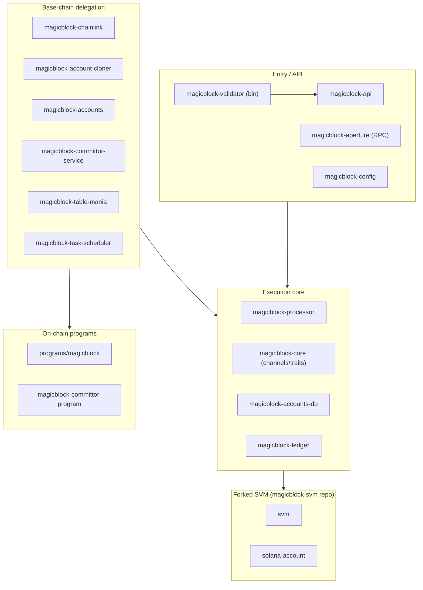
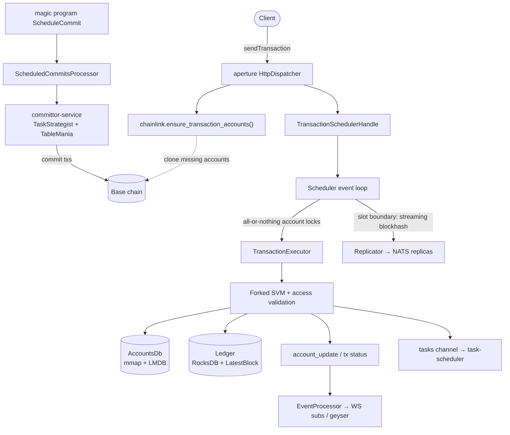

# Architecture Overview

The MagicBlock Validator is a specialized SVM runtime for **ephemeral rollups**: it
clones accounts just-in-time from a base chain (Solana mainnet/devnet), executes
transactions locally at high speed, and settles ("commits") state changes for
*delegated* accounts back to the base chain.

The workspace is ~25 crates organized in five layers, plus a forked SVM dependency
([magicblock-svm](https://github.com/magicblock-labs/magicblock-svm)) pinned in
[`Cargo.toml`](../Cargo.toml).

Cross-cutting crates: `magicblock-replicator` (primary/replica HA over NATS),
`magicblock-metrics`, `magicblock-aml`, `magicblock-version`,
`magicblock-validator-admin`.

## 1. Entry & orchestration layer

| Crate / file | Purpose |
|---|---|
| [`magicblock-validator/src/main.rs`](../magicblock-validator/src/main.rs) | Thin binary. Builds the Tokio runtime, parses config, constructs `MagicValidator`, runs TUI or headless loop, handles SIGTERM/SIGINT ([`shutdown.rs`](../magicblock-validator/src/shutdown.rs)). |
| [`magicblock-api/src/magic_validator.rs`](../magicblock-api/src/magic_validator.rs) | **The heart of the system.** `MagicValidator` owns every service: `AccountsDb`, `Ledger`, committor service, replication service, transaction scheduler handle, RPC thread, slot ticker, task scheduler, fee-claim task. |
| [`magicblock-api/src/tickers.rs`](../magicblock-api/src/tickers.rs), [`fund_account.rs`](../magicblock-api/src/fund_account.rs), [`genesis_utils.rs`](../magicblock-api/src/genesis_utils.rs) | Slot/metrics tickers, initial funding (validator identity, magic context, ephemeral vault), genesis accounts. |
| [`magicblock-config/src/lib.rs`](../magicblock-config/src/lib.rs) | `ValidatorParams` — layered config merged from CLI args → `MBV_*` env vars → TOML file → defaults. One sub-struct per concern (aperture, ledger, accountsdb, chainlink, committor, scheduler, lifecycle). |

**Boot sequence** (`MagicValidator::try_from_config` then `start()`): open ledger →
sync keypair → open accountsdb → connect replication broker (optionally fetch
snapshot) → init committor service → init chainlink → genesis accounts → metrics →
load programs → spawn transaction scheduler (in `StartingUp` mode) → spawn RPC
thread → init task scheduler. `start()` then optionally replays the ledger,
defragments accountsdb, resets stale accounts, recovers pending commit intents, and
finally flips the scheduler to `Primary`/`Replica` mode.

**Shutdown ordering matters** (`stop()`): cancellation tokens first, committor
service stopped *last* among services (in-flight intents), then threads joined, then
both databases flushed. There are three execution domains by design: a main async
runtime, a dedicated RPC runtime/thread, and a dedicated OS thread for CPU-bound
transaction execution.

## 2. RPC layer — `magicblock-aperture`

A from-scratch JSON-RPC (HTTP) + pubsub (WebSocket) server replacing Solana's RPC
stack.

- [`server/http/dispatch.rs`](../magicblock-aperture/src/server/http/dispatch.rs) —
  `HttpDispatcher` routes ~39 methods; handlers live one-per-file in
  [`requests/http/`](../magicblock-aperture/src/requests/http) (`get_account_info`,
  `send_transaction`, `simulate_transaction`, plus custom ones like
  `get_delegation_status`).
- [`server/websocket/`](../magicblock-aperture/src/server/websocket) — per-connection
  `WsDispatcher` for `accountSubscribe`, `programSubscribe`, `signatureSubscribe`,
  `logsSubscribe`, `slotSubscribe`.
- [`state/mod.rs`](../magicblock-aperture/src/state/mod.rs) — `SharedState`:
  accountsdb + ledger + chainlink + `TransactionsCache` (75 s replay-prevention
  window, deliberately longer than the 60 s blockhash validity) + `BlocksCache` +
  `SubscriptionsDb`.
- [`state/subscriptions.rs`](../magicblock-aperture/src/state/subscriptions.rs) —
  `SubscriptionsDb`: lock-free `scc::HashMap`s per subscription type; unsubscription
  is RAII via a cleanup closure that runs on drop.
- [`processor.rs`](../magicblock-aperture/src/processor.rs) — `EventProcessor`
  workers forward validator event channels → subscribers and Geyser plugins.

A read request that misses locally triggers chainlink to clone the account from the
remote first — this is how just-in-time cloning surfaces at the RPC layer.

## 3. Execution core

### `magicblock-core` — the wiring loom

Defines the channel fabric every other crate plugs into.
[`link.rs`](../magicblock-core/src/link.rs)`::link()` produces a paired
`DispatchEndpoints` (external side: RPC, event processors) ↔
`ValidatorChannelEndpoints` (internal side: scheduler/executors). Channels: bounded
mpsc for transactions in, flume for account updates and tx status out, unbounded
mpsc for scheduled tasks, plus a `pause_permit` semaphore so maintenance operations
(snapshot, checksum, defrag) can stop the world. Also home to `LockedAccount`
([`link/accounts.rs`](../magicblock-core/src/link/accounts.rs)) — an optimistic
seqlock wrapper that lets readers detect concurrent writes to memory-mapped
accounts — and shared traits (`AccountsBank`, `LatestBlockProvider`).

### `magicblock-processor` — scheduler + executors

- [`scheduler/mod.rs`](../magicblock-processor/src/scheduler/mod.rs) —
  `TransactionScheduler`: the main event loop on its own OS thread; manages an
  executor pool, slot transitions, a **streaming blake3 blockhash** (seeded with the
  previous blockhash, updated per tx signature — enables early primary/replica
  divergence detection), and replication output.
- [`scheduler/coordinator.rs`](../magicblock-processor/src/scheduler/coordinator.rs) +
  [`locks.rs`](../magicblock-processor/src/scheduler/locks.rs) —
  `ExecutionCoordinator` does **all-or-nothing account lock acquisition**.
  `AccountLock` is a single `u64` bitmask: MSB = write lock, bits 0–62 = which
  executor holds a read lock (hence a hard cap of 63 executors). Blocked
  transactions queue in per-executor heaps for FIFO retry.
- [`executor/processing.rs`](../magicblock-processor/src/executor/processing.rs) —
  `TransactionExecutor::execute()`: runs the forked SVM batch processor, commits
  accounts and emits account-update events only for successful execution,
  persists every final status to the ledger, and forwards successful scheduled
  tasks.
- [`lib.rs`](../magicblock-processor/src/lib.rs) — `SvmEnv::build_svm_env()`:
  zero-fee processing environment, feature gates, precompiles, builtins.
- `CoordinationMode`: `StartingUp` (ledger replay) → `Primary` (parallel) or
  `Replica` (strict ordering).

### `magicblock-accounts-db` — custom accounts storage

Not Agave's accounts-db. It is an **append-only memory-mapped log**
([`storage.rs`](../magicblock-accounts-db/src/storage.rs), atomic `write_cursor` in
a mmap header) plus an **LMDB index**
([`index.rs`](../magicblock-accounts-db/src/index.rs): pubkey→offset, owner→pubkey,
deallocations, owners) plus a **SnapshotManager**
([`snapshot.rs`](../magicblock-accounts-db/src/snapshot.rs): reflink/CoW when the
filesystem supports it, deep copy otherwise; tar.gz archival; restore-to-slot for
rollback). Maintenance APIs `take_snapshot()`, `defragment()`, `checksum()` are
`unsafe` — the caller must hold the scheduler's pause permit.

### `magicblock-ledger` — block/transaction history

RocksDB with 8 column families
([`database/columns.rs`](../magicblock-ledger/src/database/columns.rs)):
transactions, statuses, per-address and per-slot signatures, blocktime, blockhash,
memos, perf samples. [`lib.rs`](../magicblock-ledger/src/lib.rs) also defines
`LatestBlock` — an `ArcSwap` of `{slot, blockhash, clock}` with a broadcast channel,
giving wait-free reads of the chain tip.
[`ledger_truncator.rs`](../magicblock-ledger/src/ledger_truncator.rs) purges old
slots to bound disk usage.

## 4. Base-chain delegation

**Inbound (cloning):** [`magicblock-chainlink`](../magicblock-chainlink) is the
brain — `ensure_accounts()` / `ensure_transaction_accounts()` check the local bank,
fetch from remote RPC/WebSocket
([`remote_account_provider/`](../magicblock-chainlink/src/remote_account_provider),
with a subscription multiplexer in [`submux/`](../magicblock-chainlink/src/submux)),
track delegation status against the delegation program, and hand accounts to the
`Cloner` trait. [`magicblock-account-cloner`](../magicblock-account-cloner)
(`ChainlinkCloner`) implements it by *injecting transactions into the local
scheduler*: small accounts in one `CloneAccount` instruction, >63 KB accounts
chunked via `CloneAccountInit`/`Continue`; programs are re-deployed locally via
loader-specific paths (V1→V3 conversion, V4 buffer + deploy).

**Outbound (committing):**

1. A user program CPIs into [`programs/magicblock`](../programs/magicblock) (the
   "magic program", `Magic1111…`) with `ScheduleCommit` /
   `ScheduleCommitAndUndelegate` / `ScheduleIntentBundle`, which stages the intent
   in the 5 MB `MagicContext` account. A second validator-signed instruction
   (`AcceptScheduleCommits`) moves staged intents to a global map — a deliberate
   two-stage flow across slot boundaries.
2. [`magicblock-committor-service`](../magicblock-committor-service) runs the
   intent execution service, which periodically accepts staged intents from
   `MagicContext`, schedules them, and reports `ScheduledCommitSent` locally.
3. The committor service builds base-chain transactions:
   [`tasks/task_strategist.rs`](../magicblock-committor-service/src/tasks/task_strategist.rs)
   packs commit tasks under CPI-depth limits (falling back to a two-stage
   buffer-upload strategy for big changesets),
   [`magicblock-table-mania`](../magicblock-table-mania) manages address lookup
   tables (creation, extension, GC'd deactivation/closure),
   [`magicblock-rpc-client`](../magicblock-rpc-client) sends and confirms, and a
   SQLite persister ([`persist/`](../magicblock-committor-service/src/persist))
   survives restarts.
4. On chain, [`magicblock-committor-program`](../magicblock-committor-program)
   (`Comtr…`) receives chunked changeset buffers and applies them, interacting with
   the delegation program for undelegation.

**Other delegation crates:** [`magicblock-task-scheduler`](../magicblock-task-scheduler)
(SQLite-persisted `DelayQueue` for program-scheduled cranks, exponential backoff
retries), [`magicblock-replicator`](../magicblock-replicator) (primary/replica
streaming of transactions/blocks over NATS JetStream with leader takeover),
[`magicblock-aml`](../magicblock-aml) (cached external risk-scoring API),
[`magicblock-magic-program-api`](../magicblock-magic-program-api) (shared
instruction/PDA types so the validator doesn't link the program crate),
[`programs/guinea`](../programs/guinea) (test-only program exercising ephemeral
accounts and task scheduling).

## 5. The SVM fork

Four crates forked from Agave, hosted in
[magicblock-svm](https://github.com/magicblock-labs/magicblock-svm): `svm`,
`program-runtime`, `solana-account`, `transaction-context`. The validator consumes
`TransactionBatchProcessor::load_and_execute_sanitized_transactions()`
(`svm/src/transaction_processor.rs`) as its execution primitive. Fork-specific
changes — the most important thing to understand when reading this code:

- **`solana-account`** — `AccountSharedData` is now an enum: `Owned` (heap, like
  upstream) or `Borrowed` (`cow.rs`) — a zero-copy view into the validator's mmap
  storage with **copy-on-write shadow buffers** (an atomic switch selects primary vs
  shadow buffer; the first write triggers the copy). Seven bit-packed flags replace
  upstream semantics: `executable, delegated, privileged, compressed, undelegating,
  confined, ephemeral`. `rent_epoch` is gone (always `Epoch::MAX`).
- **`svm/src/access_permissions.rs`** (entirely fork-specific) — post-execution
  `validate_accounts_access()` enforces the ephemeral-rollup invariant: *writable
  accounts must be delegated, ephemeral, or confined* (fee payers and an allowlist
  of magic-program instruction discriminants excepted, plus a special
  "post-delegation action executor" two-instruction pattern).
- `program-runtime` and `transaction-context` are mostly upstream, adjusted for the
  new account representation.

Transaction flow inside the fork: replenish program cache → validate nonce/fee payer
→ load accounts (`account_loader.rs`) → execute instructions
(`message_processor.rs`) → **validate account access (fork)** → commit or roll back
(`rollback_accounts.rs`).

## 6. End-to-end data flow

See also [`tx-execution.md`](tx-execution.md), [`task-scheduler.md`](task-scheduler.md)
and [`sysvars.md`](sysvars.md) for deeper dives into individual subsystems.
