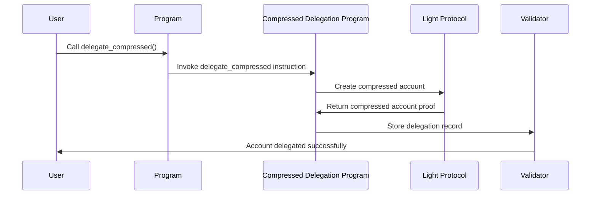
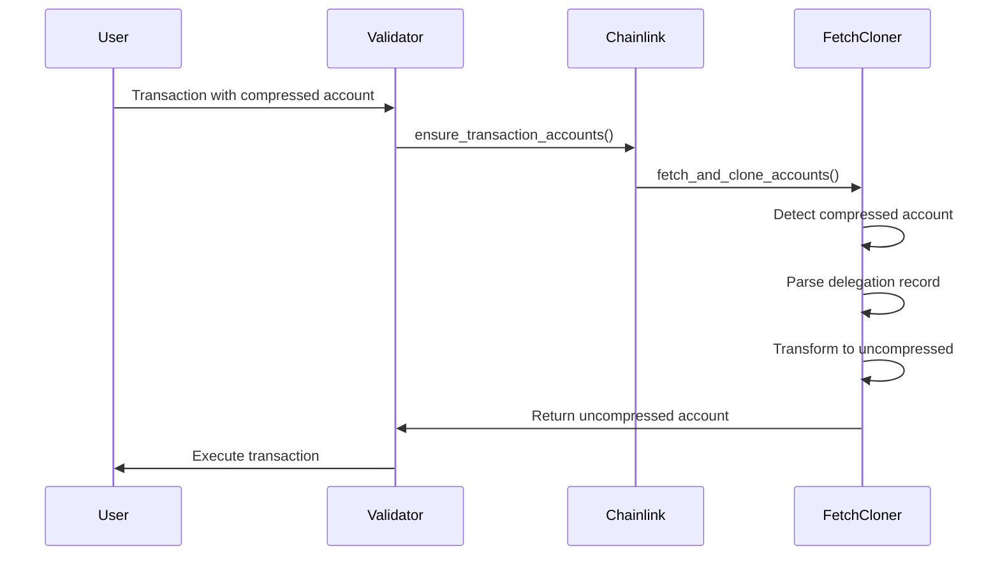
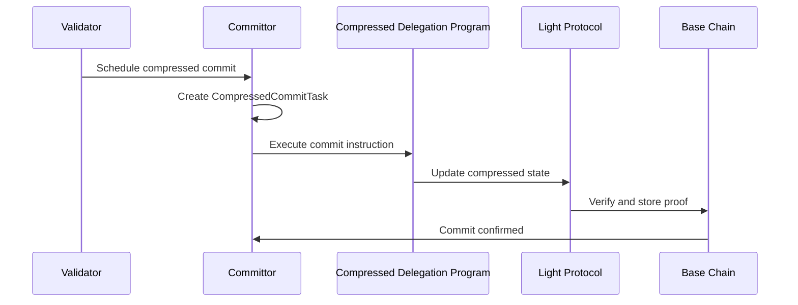

# MagicBlock Validator Compression Feature

## Overview

The MagicBlock Validator's compression feature enables efficient state management by leveraging Light Protocol's compressed account technology (zkCompression). This allows the validator to handle accounts that exist on the base chain in compressed form while using them in uncompressed form locally, providing significant rent savings and improved performance.

### What is Account Compression?

Account compression in Solana refers to storing account data off-chain in a Merkle tree structure while maintaining on-chain proofs of validity. The Light Protocol provides the infrastructure for compressed accounts, allowing:

- **Reduced storage costs**: Account data is stored off-chain
- **Scalability**: Lower on-chain footprint for applications

### Why Compression in MagicBlock Validator?

The compression feature serves several key purposes in the MagicBlock Validator ecosystem:

1. **Cost Efficiency**: Reduces the cost of delegating accounts to the validator
2. **Scalability**: Enables handling more accounts with less on-chain state
3. **State Synchronization**: Allows seamless synchronization between compressed on-chain state and uncompressed local state
4. **Cross-Program Compatibility**: Works with existing Solana programs without modification

## Architecture Overview

The compression feature consists of several interconnected components:

```mermaid
graph TB
    subgraph "User Layer"
        U[User Applications]
    end

    subgraph "Core Components"
        CDP[Compressed Delegation Program]

        subgraph MBV ["MagicBlock Validator"]
            FCL[Fetch & Clone Logic]
            CS[Committor Service]
        end
    end

    subgraph "Infrastructure Layer"
        LP[Light Protocol<br/>Infrastructure]
        CT[Compression Tasks]
    end

    U --> CDP
    U --> MBV

    CDP <--> CS
    CDP <--> FCL

    CDP --> LP
    CS --> CT

    style MBV fill:#212121
```



## Core Components

### 1. Compressed Delegation Program

**Program ID**: `DEL2rPzhFaS5qzo8XY9ZNxSzuunWueySq3p2dxJfwPbT`

This external program manages the delegation of compressed accounts to MagicBlock validators. It provides the interface between compressed accounts and the validator infrastructure.

#### Key Data Structures

**CompressedDelegationRecord**:
```rust
pub struct CompressedDelegationRecord {
    pub pda: Pubkey,                    // The uncompressed account PDA
    pub authority: Pubkey,              // Validator authority (who can modify)
    pub last_update_nonce: u64,         // Prevents replay attacks
    pub is_undelegatable: bool,         // Whether undelegation is allowed
    pub owner: Pubkey,                  // Original account owner
    pub delegation_slot: u64,           // Slot when delegation occurred
    pub lamports: u64,                  // Account lamports
    pub data: Vec<u8>,                  // Account data
}
```

### 2. MagicBlock Validator (Chainlink Component)

The validator's chainlink component handles the synchronization and local state management of compressed accounts.

#### FetchCloner Integration

When a compressed account is encountered, the `FetchCloner` performs special handling:

1. **Detection**: Identifies accounts owned by the compressed delegation program
2. **Record Parsing**: Extracts the `CompressedDelegationRecord` from the account data
3. **State Transformation**: Converts compressed state to uncompressed form
4. **Local Storage**: Stores the account in uncompressed form locally
5. **Subscription Management**: Manages subscriptions for state updates

#### Key Methods

- `is_owned_by_compressed_delegation_program()`: Detects compressed accounts
- `apply_delegation_record_to_account()`: Transforms account state
- `fetch_and_parse_delegation_record()`: Retrieves delegation metadata

### 3. Committor Service

Handles the commitment of local state changes back to the compressed on-chain state.

#### Compression Tasks

- **CompressedCommitTask**: Commits local changes to compressed accounts
- **CompressedFinalizeTask**: Finalizes compressed account operations
- **CompressedUndelegateTask**: Handles undelegation of compressed accounts

## Complete Compression Flow

### 1. Account Delegation (Compression)



#### Steps:
1. User calls a program's `delegate_compressed` instruction
2. Program invokes the Compressed Delegation Program
3. CDP creates a compressed account via Light Protocol
4. CDP stores the delegation record with validator authority
5. Account is now accessible in uncompressed form locally

### 2. Account Usage (Local Operations)



#### Steps:
1. Transaction references a compressed account
2. Chainlink ensures account availability
3. FetchCloner detects compressed ownership
4. Parses the CompressedDelegationRecord
5. Transforms account to uncompressed form
6. Stores locally for transaction execution

### 3. State Commitment (Decompression)



#### Steps:
1. Validator schedules compressed commit via Committor Service
2. Committor creates appropriate compression task
3. Task executes commit instruction on Compressed Delegation Program
4. CDP updates compressed state via Light Protocol
5. State changes are committed to base chain

## Data Structures and Types

### Address Derivation

Compressed accounts use a deterministic address derivation:

```rust
pub fn derive_cda_from_pda(pda: &Pubkey) -> Pubkey {
    let seed = hashv_to_bn254_field_size_be_const_array::<3>(&[&pda.to_bytes()]);
    let address = derive_address(&seed, &ADDRESS_TREE, &COMPRESSED_DELEGATION_ID);
    Pubkey::new_from_array(address)
}
```

## Integration with Chainlink

### Account Detection and Handling

The `FetchCloner` automatically detects compressed accounts by checking ownership:

```rust
let owned_by_compressed_delegation_program =
    account.is_owned_by_compressed_delegation_program();
```

### State Transformation

When a compressed account is detected:

1. Parse the `CompressedDelegationRecord` from account data
2. Set account as compressed: `account.set_compressed(true)`
3. Set proper owner: `account.set_owner(delegation_record.owner)`
4. Set account data: `account.set_data(delegation_record.data)`
5. Set lamports: `account.set_lamports(delegation_record.lamports)`
6. Mark as delegated: `account.set_delegated(is_delegated_to_us)`

### Subscription Management

Compressed accounts require special subscription handling:

- **Delegation records are never subscribed to by design** - no subscription occurs for compressed delegation records
- **Accounts are unsubscribed when delegated** to maintain synchronization with compressed state
- **Updates for delegated accounts must be retrieved via the Photon indexer** rather than subscriptions
- Undelegating accounts are kept until undelegation completes

## Committor Service Integration

### Task Types

**CompressedCommitTask**:
- Commits local account changes to compressed state
- Updates the CompressedDelegationRecord
- Generates ZK proofs for state transitions

**CompressedFinalizeTask**:
- Finalizes compressed account operations
- Handles cleanup after successful commits

**CompressedUndelegateTask**:
- Removes delegation from compressed accounts
- Transitions accounts back to fully compressed state

### Task Execution Flow

1. **Preparation**: Gather compressed account data and current state
2. **Proof Generation**: Create ZK proofs for state transitions
3. **Instruction Building**: Construct compressed delegation program instructions
4. **Execution**: Submit transactions to base chain
5. **Confirmation**: Wait for confirmation and update local state

## Configuration and Setup

### Required Dependencies

- `compressed-delegation-client`: Client library for compressed delegation
- `light-client`: Light Protocol client for compressed accounts
- `light-sdk`: Light Protocol SDK for ZK operations
- `solana-program`: Solana program dependencies

### Environment Constants

```rust
pub const COMPRESSED_DELEGATION_ID: Pubkey =
    pubkey!("DEL2rPzhFaS5qzo8XY9ZNxSzuunWueySq3p2dxJfwPbT");

pub const ADDRESS_TREE: Pubkey =
    pubkey!("amt2kaJA14v3urZbZvnc5v2np8jqvc4Z8zDep5wbtzx");

pub const OUTPUT_QUEUE: Pubkey =
    pubkey!("oq1na8gojfdUhsfCpyjNt6h4JaDWtHf1yQj4koBWfto");
```

## Error Handling

### Common Error Scenarios

1. **Invalid Compressed Account**: Account data doesn't contain valid delegation record
2. **Proof Verification Failure**: ZK proofs fail verification
3. **Insufficient Balance**: Account lacks lamports for operations
4. **Unauthorized Access**: Non-validator attempts to modify delegated accounts

### Recovery Mechanisms

- **Fallback Fetching**: Retry account fetching with different methods
- **State Validation**: Verify account state integrity before operations
- **Graceful Degradation**: Fall back to uncompressed operations when possible

## Testing and Validation

### Integration Tests

The compression feature includes comprehensive integration tests covering:

- Compressed account delegation and undelegation
- State synchronization between compressed and uncompressed forms
- Commit operations and state settlement
- Error scenarios and edge cases

### Test Infrastructure

- **IxtestContext**: Test context providing compressed account utilities
- **Photon Indexer**: Mock indexer for compressed account proofs
- **Chainlink Integration**: Full chainlink testing with compression

## Performance Considerations

### Benefits

- **Storage Efficiency**: ~10x reduction in on-chain storage costs
- **Network Efficiency**: Reduced data transfer for account synchronization

### Trade-offs

- **Computational Overhead**: ZK proof generation and verification
- **Latency**: Additional round trips for proof fetching
- **Complexity**: Increased system complexity for state management

## Future Enhancements

### Planned Features

1. **Use BufferTasks**: Using `BufferTask` instead of `ArgTask` allows managing larger accounts.
2. **Work directly with compressed accounts**: The current implementation requires that an empty PDA exists to ensure the corresponding compressed account can be created only once. Using compressed account created directly by the user program would allow onboarding compressed accounts users simply.
