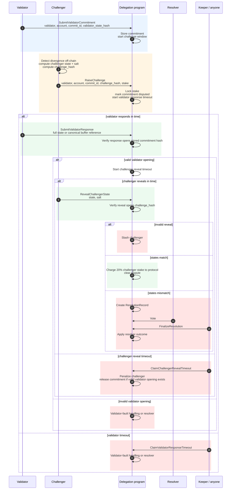

I tried to translate the MIMD into a concrete call flow to check whether I am
interpreting the proposal correctly. I am intentionally not repeating the full
actor list, economic rules, or commitment format from the proposal. This is only
the extra structure I think is implied by the text, plus the places where the
proposal still seems ambiguous.

> [!NOTE]
> **Assumptions / terms I am using**
>
> - By **validator commitment**, I mean an already submitted on-chain commitment
>   hash for `validator + account + commit_id`, even if that commitment has not
>   been finalized yet.
> - By **finalization**, I mean the later step that applies or accepts the
>   committed state as final after the challenge window / council condition /
>   dispute path allows it.
> - By **pre-commit challenge**, I assume the MIMD means a challenge raised
>   before a `ValidatorCommitment` exists, using only an expected
>   `account + commit_id` or some statement about what the validator intends to
>   commit.
>
> With those meanings, my current interpretation is that V1 should only support
> challenges against an existing validator commitment. If "pre-commit" instead
> means "after validator commitment but before finalization", then I think that
> is the normal challenge path below and we may not need a separate pre-commit
> path.
>
> The confusing case is a challenge before any validator commitment exists. That
> seems harder to reason about unless the validator has produced a signed
> pre-commit object that can be challenged objectively.

**Records I think are implied**

- **ValidatorBond**: the slashable validator/operator stake, separate from the
  fee vault.
- **ValidatorCommitment**: one committed account update, keyed by validator,
  account, and commit id.
- **ChallengeRecord**: one active challenge against a validator commitment,
  including the challenge hash, locked stake, deadlines, and terminal outcome.
- **StateBuffer**: optional canonical buffer for large account data.
- **ResolutionRecord**: resolver state for mismatches or validator failures.

I think commitment keys need to include the validator identity:

```text
validator_identity + account_pubkey + commit_id
```

Otherwise `account_pubkey + commit_id` is ambiguous if more than one validator
can commit state for the same account and commit id.

**Important interpretation: validator response opens the original commitment**

My read is that `SubmitValidatorResponse` should not be a new claim made after
the challenge starts. It should reveal the account state behind the original
validator commitment, and the delegation program should verify:

```text
H(validator_response_state) == stored_validator_commitment_hash
```

This avoids the case where a validator originally committed `H(bad_state)`, then
responds to the challenge with `correct_state`, making the challenge look
unnecessary.

**Sequence as I understand it**



**Commentary on the sequence**

- Start from an account that is already delegated, has been modified on ER, and
  has a next `commit_id` / nonce for this account update.
- The validator first creates a DLP-visible commitment artifact. In this LLD,
  that artifact is called `ValidatorCommitment` and is bound to:

```text
validator_identity + account_pubkey + commit_id
```

- A challenger does not challenge unanchored validator memory. The challenger
  independently computes the expected ER account state off-chain, then watches
  DLP program transactions or DLP-owned account changes for the validator's
  on-chain commitment for the same account and commit id.
- In the current implementation, the closest concrete artifacts are the
  `commit_state_pda` and `commit_record_pda` created by `CommitState` /
  `CommitStateFromBuffer`. The challenge-enabled protocol should either define
  a first-class `ValidatorCommitment` account or extend the commit record so it
  explicitly stores the committed hash and challenge/finality status.
- If the challenger disagrees with the validator commitment, it raises a
  challenge by locking stake and submitting `challenge_hash`, which is a salted
  commitment to the challenger state and full challenge context.
- The delegation program records the challenge, locks challenger stake, marks
  the validator commitment disputed, and blocks normal finalization for that
  commitment until the challenge reaches a terminal outcome.
- The validator response must reveal the state behind the original stored
  validator commitment. The delegation program must verify that the response
  opens the stored `validator_state_hash`; it must not accept a fresh state
  claim that differs from the original commitment.
- After a valid validator opening, the challenger reveals its state and salt.
  The delegation program recomputes `challenge_hash`. If the reveal does not
  open the original challenge hash, the challenger is fully slashed.
- If the challenger reveal is valid and both states match, the challenge was
  unnecessary but valid. The challenger loses 20% of the locked stake to the
  protocol, the remaining stake is unlocked, and the commitment is cleared for
  finalization.
- If the valid challenger state differs from the valid validator state, the
  protocol has proven disagreement but not fault. The delegation program creates
  a `ResolutionRecord`, and the resolver decides whether the validator state or
  challenger state is correct.
- Finalization is a later step. It can proceed only if no challenge exists, the
  challenge has been cleared, or the challenge has been resolved and the
  finalizing state matches the resolved state.

**Messages I think are missing or need to be explicit**

| Message | Why it matters |
| --- | --- |
| `RegisterValidator` | Needed if validator participation moves to a permissionless slashable-bond model. |
| `SubmitValidatorCommitment` | Needed as the concrete object a challenge references. |
| `SubmitValidatorResponse` | Must explicitly open the original commitment, not submit a fresh answer. |
| `ClaimValidatorResponseTimeout` | Needed so validator non-response can be finalized by anyone. |
| `ClaimChallengerRevealTimeout` | Needed so challengers cannot lock commitments and disappear. |
| `FinalizeResolution` | Needed so council/resolver output actually transitions the challenge to terminal state. |

**Finalization rule I infer**

`CommitFinalize` or any optimized finalization path should check:

- no unresolved challenge exists for the commitment;
- if disputed, the finalizing state matches the resolved state;
- required optimistic-finality or council co-signing conditions are satisfied.

The 20% penalty for a valid but unnecessary challenge goes to the protocol. The
48 hour timelock in the MIMD is a payout delay for a successful challenger, not
an appeal window.

**Questions / possible gaps**

- Does validator timeout directly slash, or always go through resolver?
- What happens on resolver no-quorum?
- Is only one active challenge allowed per validator commitment?
- Is full validator-bond slashing proportional for one account fault?
- What are the exact serialization and missing-account rules?
