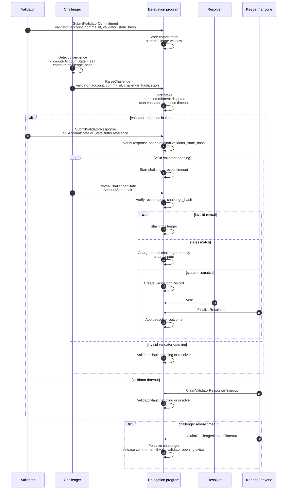

# LLD: MIMD Challenge Mechanism

## Purpose

First implementation sketch for challenge intake and resolution routing. This
draft only covers challenges against an existing validator commitment.

Pre-commit challenges should be left out of V1 unless validators produce a
signed pre-commit object that can be challenged objectively.

## Parties

- **Validator**: submits account-state commitments and maintains a slashable
  operator bond. The fee vault is not slashable stake.
- **Challenger**: detects a suspicious commitment, locks challenge stake, and
  commits to the state it believes is correct using a salted hash.
- **Delegation program**: stores commitments/challenges, verifies openings,
  enforces timeouts, blocks disputed finalization, and applies outcomes.
- **Resolver**: initially the security council; used for mismatches and
  validator failures that are not handled directly by the program.

## Records

- **ValidatorBond**: validator identity, bond authority, bonded amount,
  withdrawal status, slashable balance.
- **ValidatorCommitment**: validator identity, account public key, commit id,
  validator state hash, optional slot metadata, status, challenge-window expiry.
- **ChallengeRecord**: validator, challenger, account, commit id, challenged
  commitment reference, challenge hash, locked stake, phase, deadlines, response
  hash, reveal hash, terminal outcome.
- **StateBuffer**: optional canonical buffer for large account data.
- **ResolutionRecord**: challenge id, validator state hash, challenger state
  hash, voting deadline, vote totals, result.

Commitment keys should include:

```text
validator_identity + account_pubkey + commit_id
```

## Account State And Hashes

Canonical challenged state:

```text
AccountState = Present { lamports, owner, data } | Missing
```

Validator commitment:

```text
validator_state_hash = H(
  "magicblock.validator-state.v1",
  validator_identity,
  account_pubkey,
  commit_id,
  account_state
)
```

Challenger commitment:

```text
challenge_hash = H(
  "magicblock.challenge.v1",
  validator_identity,
  challenger_identity,
  account_pubkey,
  commit_id,
  challenger_account_state,
  salt
)
```

Important rule: the validator response must open the original validator
commitment. It is not a new claim. The program recomputes
`validator_state_hash` from the response and checks it equals the stored
commitment hash.

## Sequence Diagram



## Messages

| Message | Caller | Main contents | Main effect |
| --- | --- | --- | --- |
| `RegisterValidator` | Validator | validator identity, bond amount, bond authority | Creates or updates slashable `ValidatorBond`. |
| `SubmitValidatorCommitment` | Validator | validator, account, commit id, validator state hash, optional slot metadata | Creates `ValidatorCommitment` and starts challenge window. |
| `RaiseChallenge` | Challenger | validator, account, commit id, `challenge_hash`, challenger stake | Locks stake, creates `ChallengeRecord`, marks commitment disputed. |
| `SubmitValidatorResponse` | Validator | challenge id, full account state or finalized `StateBuffer` reference | Verifies response opens original validator commitment. |
| `RevealChallengerState` | Challenger | challenge id, full account state or buffer reference, salt | Verifies reveal opens `challenge_hash`, then matches or routes to resolution. |
| `ClaimValidatorResponseTimeout` | Anyone | challenge id | Records validator non-response and enters validator-fault handling or resolver. |
| `ClaimChallengerRevealTimeout` | Anyone | challenge id | Penalizes challenger if reveal deadline expired. |
| `SubmitResolutionVote` | Council member | challenge id, selected outcome, optional evidence reference | Adds stake-weighted resolver vote. |
| `FinalizeResolution` | Anyone | challenge id | Applies resolver result and unblocks finalization according to outcome. |

## Outcomes

| Case | Result |
| --- | --- |
| Valid reveal and states match | Challenger pays partial penalty; remaining stake unlocks; validator not slashed. |
| Invalid challenger reveal | Challenger slashed. |
| Challenger reveal timeout after valid validator opening | Challenger slashed or heavily penalized; dispute cleared. |
| Validator timeout | Validator-fault handling or resolver. |
| Validator response does not open original commitment | Validator-fault handling or resolver. |
| Valid mismatch | Resolver decides validator correct, challenger correct, neither valid, or inconclusive. |

## Finalization Rule

A disputed commitment must not finalize until the challenge is terminal.

Any `CommitFinalize` path should check:

- no unresolved challenge exists for the commitment;
- if disputed, the finalizing state matches the resolved state;
- required optimistic-finality or council co-signing conditions are satisfied.

## Required Invariants

- A challenge references a concrete validator commitment.
- Validator response opens the original validator commitment.
- Challenger reveal opens the original challenge hash.
- Active challenges block finalization of the challenged commitment.
- Timeouts are callable by anyone.
- Large account data has one canonical buffered representation.
- Resolver can return `neither valid` or `inconclusive`.

## Open Questions

- Does validator timeout directly slash, or always go through resolver?
- What happens on resolver no-quorum?
- Is only one active challenge allowed per validator commitment?
- Where does the partial challenger penalty go?
- Is full validator-bond slashing proportional for one account fault?
- What is the purpose of the 48 hour payout timelock if it is not an appeal
  window?
- What are the exact serialization and missing-account rules?

