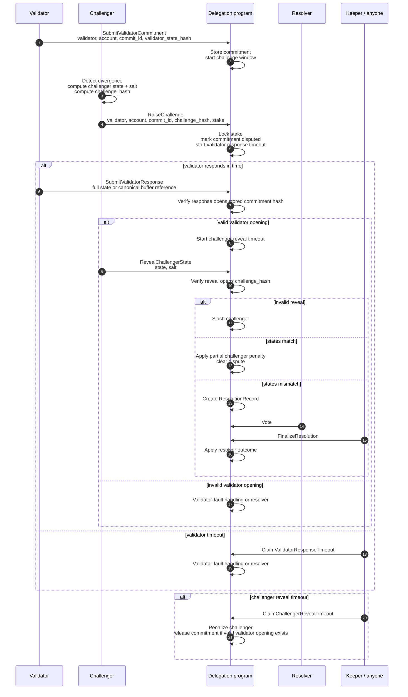

I tried to translate the MIMD into a concrete call flow to check whether I am
interpreting the proposal correctly. I am intentionally not repeating the full
actor list, economic rules, or commitment format from the proposal. This is only
the extra structure I think is implied by the text, plus the places where the
proposal still seems ambiguous.

> [!NOTE]
> **Assumptions / terms I am using**
>
> - By **validator commitment**, I mean an already submitted on-chain commitment
>   hash for `validator + account + commit_id`, even if that commitment has not
>   been finalized yet.
> - By **finalization**, I mean the later step that applies or accepts the
>   committed state as final after the challenge window / council condition /
>   dispute path allows it.
> - By **pre-commit challenge**, I assume the MIMD means a challenge raised
>   before a `ValidatorCommitment` exists, using only an expected
>   `account + commit_id` or some statement about what the validator intends to
>   commit.
>
> With those meanings, my current interpretation is that V1 should only support
> challenges against an existing validator commitment. If "pre-commit" instead
> means "after validator commitment but before finalization", then I think that
> is the normal challenge path below and we may not need a separate pre-commit
> path.
>
> The confusing case is a challenge before any validator commitment exists. That
> seems harder to reason about unless the validator has produced a signed
> pre-commit object that can be challenged objectively.

**Records I think are implied**

- **ValidatorBond**: the slashable validator/operator stake, separate from the
  fee vault.
- **ValidatorCommitment**: one committed account update, keyed by validator,
  account, and commit id.
- **ChallengeRecord**: one active challenge against a validator commitment,
  including the challenge hash, locked stake, deadlines, and terminal outcome.
- **StateBuffer**: optional canonical buffer for large account data.
- **ResolutionRecord**: resolver state for mismatches or validator failures.

I think commitment keys need to include the validator identity:

```text
validator_identity + account_pubkey + commit_id
```

Otherwise `account_pubkey + commit_id` is ambiguous if more than one validator
can commit state for the same account and commit id.

**Important interpretation: validator response opens the original commitment**

My read is that `SubmitValidatorResponse` should not be a new claim made after
the challenge starts. It should reveal the account state behind the original
validator commitment, and the delegation program should verify:

```text
H(validator_response_state) == stored_validator_commitment_hash
```

This avoids the case where a validator originally committed `H(bad_state)`, then
responds to the challenge with `correct_state`, making the challenge look
unnecessary.

**Sequence as I understand it**



**Messages I think are missing or need to be explicit**

| Message | Why it matters |
| --- | --- |
| `RegisterValidator` | Needed if validator participation moves to a permissionless slashable-bond model. |
| `SubmitValidatorCommitment` | Needed as the concrete object a challenge references. |
| `SubmitValidatorResponse` | Must explicitly open the original commitment, not submit a fresh answer. |
| `ClaimValidatorResponseTimeout` | Needed so validator non-response can be finalized by anyone. |
| `ClaimChallengerRevealTimeout` | Needed so challengers cannot lock commitments and disappear. |
| `FinalizeResolution` | Needed so council/resolver output actually transitions the challenge to terminal state. |

**Finalization rule I infer**

`CommitFinalize` or any optimized finalization path should check:

- no unresolved challenge exists for the commitment;
- if disputed, the finalizing state matches the resolved state;
- required optimistic-finality or council co-signing conditions are satisfied.

**Questions / possible gaps**

- Does validator timeout directly slash, or always go through resolver?
- What happens on resolver no-quorum?
- Is only one active challenge allowed per validator commitment?
- Where does the partial challenger penalty go?
- Is full validator-bond slashing proportional for one account fault?
- What is the purpose of the 48 hour payout timelock if it is not an appeal
  window?
- What are the exact serialization and missing-account rules?
