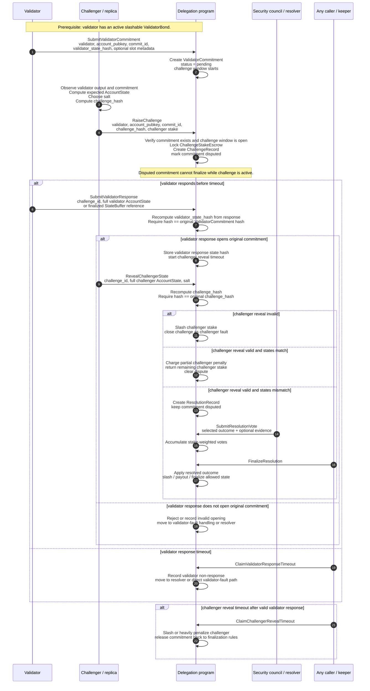

# LLD: MIMD Challenge Mechanism

## Purpose

This document expands the challenge proposal into a first low-level design.
It focuses on the protocol components, records/accounts, call sequence, and
important messages needed for a first implementation draft.

The design intentionally stays above Rust type and serialization details. Exact
byte layouts, hash function, rent sizing, and instruction encoding can be
specified after the protocol flow is agreed.

## Scope

V1 should focus on challenges against an existing validator commitment:

- a validator has already committed a state hash for one account at one commit id;
- a challenger believes that committed state is incorrect;
- the challenger raises a challenge before the challenge window expires;
- the validator must open the exact original commitment;
- the challenger reveals its committed state;
- the delegation program either resolves the simple cases directly or moves the
  disagreement into resolution.

Pre-commit challenges should be deferred unless the protocol introduces a
signed pre-commit artifact. Without that artifact, "about to commit" is hard to
verify objectively and can be used to force validators to answer speculative
state claims.

## Main Parties

### Validator

The validator produces account state updates and submits commitments for those
updates to the delegation program.

The validator must have a slashable operator bond. The current fee vault should
not be treated as validator stake.

### Challenger

The challenger is any participant with the required minimum challenge stake.

The challenger usually runs a replica, watches validator output, detects a
divergence, and raises a challenge for a specific validator, account, and
commit id.

The challenger must already know the state it believes is correct before raising
the challenge. The first transaction only publishes a salted hash of that state;
the state itself is revealed later.

### Delegation Program

The delegation program is the on-chain coordinator. It stores validator
commitments, locks challenger stake, records challenge state, verifies hashes,
enforces timeouts, prevents disputed commitments from finalizing, and applies
the terminal outcome.

The delegation program does not need to decide every mismatch by itself in V1.
For mismatches, it can hand off to the configured resolver, initially the
security council.

## Supporting Resolver

The initial proposal uses a stake-weighted security council for disputed
mismatches. The council is not one of the three main runtime parties above, but
it is the initial resolution mechanism after the delegation program determines
that the validator and challenger states disagree.

Future versions can replace this resolver with objective replay, for example on
a zkSVM, without changing the basic challenge intake flow.

## Core Concept: Commitment Opening

The validator commitment must be treated as a hash commitment.

When the validator originally commits an account update, it submits a hash:

```text
validator_state_hash = H(
  "magicblock.validator-state.v1",
  validator_identity,
  account_pubkey,
  commit_id,
  canonical_account_state
)
```

During a challenge, the validator must reveal the full account state behind
that original hash. This reveal is called opening the commitment.

The delegation program must recompute:

```text
H("magicblock.validator-state.v1", validator, account, commit_id, validator_response_state)
```

and verify that it equals the original `validator_state_hash`.

This check is critical. Without it, a validator that committed a bad state could
respond during the challenge with the correct state and make the challenge look
unnecessary. The validator response must defend the original commitment, not
submit a new answer after being challenged.

## Canonical Account State

For challenge purposes, account state should be represented as:

```text
AccountState =
  Present {
    lamports,
    owner,
    data
  }
  | Missing
```

Notes:

- `owner` should be committed explicitly.
- `data` means the full account data bytes, not only a short digest, unless the
  full bytes are available through a protocol-defined buffer mechanism.
- `executable` can stay out of scope if executable accounts are not delegatable.
- Missing account representation must be canonical before slashing is enabled.
- The current implementation commits lamports plus data. Challenge-enabled
  commitments should include owner as well before the protocol relies on this
  mechanism for slashing.

## Program Records / Accounts

These are conceptual accounts. Names are descriptive, not final Rust names.

### ProtocolConfig

Global challenge parameters:

- minimum challenger stake;
- minimum validator bond;
- challenge window;
- validator response timeout;
- challenger reveal timeout;
- council quorum and voting threshold;
- council voting timeout;
- slash destinations;
- hash function identifier;
- canonical serialization version.

### ValidatorBond

Slashable validator/operator stake:

- validator identity;
- bond authority;
- bonded amount;
- active or withdrawing status;
- withdrawal delay;
- slashable balance;
- optional metadata.

The validator must have an active bond before submitting commitments that can be
challenged.

### ValidatorCommitment

One committed account update:

- validator identity;
- account public key;
- commit id;
- validator state hash;
- optional ephemeral slot metadata;
- optional data availability reference;
- status:
  - pending;
  - disputed;
  - finalized;
  - resolved;
  - invalidated;
- challenge window expiry.

The unique commitment key should include:

```text
validator_identity + account_pubkey + commit_id
```

Using only `account_pubkey + commit_id` is not sufficient if multiple validators
can commit updates for the same account and commit id.

### ChallengeRecord

One challenge raised by one challenger:

- validator identity;
- challenger identity;
- account public key;
- commit id;
- reference to the challenged `ValidatorCommitment`;
- challenger commitment hash;
- locked challenger stake amount;
- current phase;
- validator response deadline;
- challenger reveal deadline;
- validator response state hash, after response;
- challenger revealed state hash, after reveal;
- terminal outcome, if resolved.

The challenge key should include the validator and challenger, for example:

```text
validator_identity + account_pubkey + commit_id + challenger_identity
```

The protocol may still allow only one active challenge per validator commitment.
If so, the commitment should point to the active challenge. This prevents
duplicate disputes while still avoiding ambiguous account-only keys.

### ChallengeStakeEscrow

Escrow for the challenger's locked stake:

- challenge id;
- challenger identity;
- locked amount;
- status:
  - locked;
  - partially charged;
  - returned;
  - slashed.

This can be a separate token/stake account or an internal program-controlled
escrow record, depending on the final staking model.

### StateBuffer

Optional buffer used when full account data is too large for one transaction:

- challenge id;
- submitting party:
  - validator;
  - challenger;
- expected state metadata;
- chunks or chunk commitments;
- finalized buffer hash;
- cleanup status.

The buffer must be canonical. The protocol needs a single way to turn buffered
data into the exact bytes used by the account-state hash.

### ResolutionRecord

Created when the validator and challenger states do not match:

- challenge id;
- validator response state hash;
- challenger revealed state hash;
- voting start;
- voting deadline;
- vote totals;
- result:
  - validator correct;
  - challenger correct;
  - neither valid;
  - inconclusive or no quorum.

V1 may use council voting. Later versions may replace this record with a proof
verification record.

## Important Messages

This section describes the messages at a protocol level. It does not define
final instruction names.

### RegisterValidator

Called by the validator/operator before submitting slashable commitments.

Inputs:

- validator identity;
- bond amount;
- bond authority;
- optional metadata.

Accounts/records:

- `ProtocolConfig`;
- validator's stake source;
- `ValidatorBond`.

Effects:

- creates or updates the validator bond;
- marks the validator eligible to submit challengeable commitments.

### SubmitValidatorCommitment

Called by the validator when it commits an account update.

Inputs:

- validator identity;
- account public key;
- commit id;
- validator state hash;
- optional ephemeral slot metadata;
- optional data availability reference.

Accounts/records:

- `ProtocolConfig`;
- `ValidatorBond`;
- `ValidatorCommitment`.

Effects:

- records the commitment;
- starts the challenge window;
- leaves the commitment pending until optimistic finalization or dispute
  resolution.

Required invariant:

- the commitment must be keyed by validator, account, and commit id.

### RaiseChallenge

Called by the challenger after detecting a bad or suspicious commitment.

Before calling, the challenger does the following off-chain:

1. Finds the validator commitment for `validator + account + commit_id`.
2. Computes the account state it believes is correct.
3. Chooses a random salt.
4. Computes:

```text
challenge_hash = H(
  "magicblock.challenge.v1",
  validator_identity,
  challenger_identity,
  account_pubkey,
  commit_id,
  challenger_account_state,
  salt
)
```

Inputs:

- validator identity;
- challenger identity;
- account public key;
- commit id;
- challenger commitment hash;
- locked stake amount;
- optional evidence reference for observability.

Accounts/records:

- `ProtocolConfig`;
- `ValidatorBond`;
- `ValidatorCommitment`;
- `ChallengeRecord`;
- `ChallengeStakeEscrow`;
- challenger's stake source.

Effects:

- verifies the challenged commitment exists and is still within the challenge
  window;
- locks challenger stake;
- records the challenge hash;
- marks the validator commitment as disputed;
- blocks finalization of the challenged account update;
- starts the validator response timeout.

The challenger does not reveal the account state in this call.

### SubmitValidatorResponse

Called by the validator after a challenge is raised.

The validator must submit the full account state that opens the original
validator commitment.

Inputs:

- challenge id;
- validator identity;
- account public key;
- commit id;
- account state:
  - present or missing;
  - lamports, if present;
  - owner, if present;
  - full data bytes or a finalized state buffer reference.

Accounts/records:

- `ProtocolConfig`;
- `ValidatorBond`;
- `ValidatorCommitment`;
- `ChallengeRecord`;
- optional validator `StateBuffer`.

Effects:

- reconstructs the validator response state;
- recomputes the validator state hash using the exact original commitment
  domain and context;
- verifies that the recomputed hash equals the `ValidatorCommitment` hash;
- stores the validator response state hash;
- starts the challenger reveal timeout.

If the validator response does not open the original commitment, the validator
has failed to defend the commitment. The protocol should either treat this as
validator fault directly or move it to resolution with invalid opening as
strong evidence against the validator.

### RevealChallengerState

Called by the challenger after the validator response is accepted.

Inputs:

- challenge id;
- challenger identity;
- account state:
  - present or missing;
  - lamports, if present;
  - owner, if present;
  - full data bytes or a finalized state buffer reference;
- salt.

Accounts/records:

- `ProtocolConfig`;
- `ValidatorCommitment`;
- `ChallengeRecord`;
- `ChallengeStakeEscrow`;
- optional challenger `StateBuffer`.

Effects:

- recomputes the challenger hash;
- verifies it equals the hash submitted in `RaiseChallenge`;
- compares challenger state with validator response state;
- routes to one of the terminal or resolution paths below.

If the hash does not match, the challenger is at fault and the challenger stake
is fully slashed.

If the hash matches and both states match, the challenge was valid but
unnecessary. The challenger is charged the configured partial penalty, for
example 20%, and the remaining stake is returned.

If the hash matches and the states do not match, the protocol has established a
real disagreement. The challenge moves to resolution.

### ClaimValidatorResponseTimeout

Called by anyone after the validator response deadline passes.

Inputs:

- challenge id.

Accounts/records:

- `ProtocolConfig`;
- `ValidatorBond`;
- `ValidatorCommitment`;
- `ChallengeRecord`.

Effects:

- records validator non-response;
- prevents the validator from submitting a late response;
- moves the challenge to validator-fault handling or council resolution,
  depending on the final policy.

Recommendation:

- if a validator cannot open its own commitment within the response timeout,
  that should be treated as strong validator fault. The council may still be
  used to finalize the account state if the protocol does not want direct
  slashing on timeout alone.

### ClaimChallengerRevealTimeout

Called by anyone after the challenger reveal deadline passes.

Inputs:

- challenge id.

Accounts/records:

- `ProtocolConfig`;
- `ValidatorCommitment`;
- `ChallengeRecord`;
- `ChallengeStakeEscrow`.

Effects:

- records challenger non-reveal;
- fully slashes or heavily penalizes the challenger;
- releases the disputed commitment from the challenge, assuming the validator
  response opened the original commitment;
- allows normal finalization rules to continue.

This timeout is necessary. Otherwise a challenger could lock a commitment and
never reveal.

### SubmitResolutionVote

Called by security council members in V1 after a mismatch.

Inputs:

- challenge id;
- voter identity;
- selected outcome:
  - validator correct;
  - challenger correct;
  - neither valid;
  - inconclusive;
- optional evidence reference.

Accounts/records:

- `ProtocolConfig`;
- `ResolutionRecord`;
- council stake or membership record;
- `ChallengeRecord`.

Effects:

- records or updates the council vote;
- accumulates stake-weighted totals.

### FinalizeResolution

Called by anyone once the council threshold is met or the voting timeout has
expired.

Inputs:

- challenge id.

Accounts/records:

- `ProtocolConfig`;
- `ValidatorBond`;
- `ValidatorCommitment`;
- `ChallengeRecord`;
- `ChallengeStakeEscrow`;
- `ResolutionRecord`.

Effects depend on the result:

- validator correct:
  - challenger stake fully slashed;
  - validator bond unchanged;
  - validator state becomes the resolved state;
  - commitment can finalize under resolved-state rules.
- challenger correct:
  - validator bond slashed according to protocol rules;
  - challenger receives configured payout after timelock;
  - challenger state becomes the resolved state;
  - commitment can finalize under resolved-state rules.
- neither valid:
  - validator and challenger penalties are applied according to final policy;
  - account state is not finalized from either submitted state;
  - recovery path must be defined.
- no quorum or inconclusive:
  - fallback policy is applied;
  - this policy must be finalized before implementation.

## Primary Call Sequence

### Call Sequence Diagram



### Detailed Sequence

```text
1. Validator registers slashable bond
   Validator -> DelegationProgram:
     RegisterValidator(validator_identity, bond_amount)

2. Validator submits account commitment
   Validator -> DelegationProgram:
     SubmitValidatorCommitment(
       validator_identity,
       account_pubkey,
       commit_id,
       validator_state_hash,
       optional_slot_metadata
     )

3. Challenger detects divergence off-chain
   Challenger:
     observes validator commitment
     computes expected correct account state
     chooses salt
     computes challenge_hash

4. Challenger raises challenge
   Challenger -> DelegationProgram:
     RaiseChallenge(
       validator_identity,
       account_pubkey,
       commit_id,
       challenge_hash,
       challenger_stake
     )

   DelegationProgram:
     locks challenger stake
     marks commitment disputed
     starts validator response timeout

5. Validator opens original commitment
   Validator -> DelegationProgram:
     SubmitValidatorResponse(
       challenge_id,
       full_validator_account_state
     )

   DelegationProgram:
     checks H(full_validator_account_state) == original validator_state_hash
     stores validator response state hash
     starts challenger reveal timeout

6. Challenger reveals committed state
   Challenger -> DelegationProgram:
     RevealChallengerState(
       challenge_id,
       full_challenger_account_state,
       salt
     )

   DelegationProgram:
     checks H(full_challenger_account_state, salt) == challenge_hash
     compares validator state and challenger state

7A. If states match
   DelegationProgram:
     charges partial challenger penalty
     returns remaining challenger stake
     clears dispute
     allows normal finalization rules

7B. If states mismatch
   DelegationProgram:
     creates resolution record
     keeps commitment disputed
     waits for resolver

8. Resolver decides mismatch
   Council -> DelegationProgram:
     SubmitResolutionVote(challenge_id, selected_outcome)

   Anyone -> DelegationProgram:
     FinalizeResolution(challenge_id)
```

## State Machine

```text
NoChallenge
  -> AwaitingValidatorResponse
  -> AwaitingChallengerReveal
  -> MatchedClosed
  -> MismatchResolution
  -> ResolvedValidatorCorrect
  -> ResolvedChallengerCorrect
  -> ResolvedNeitherOrInconclusive

AwaitingValidatorResponse
  -> ValidatorTimeout

AwaitingChallengerReveal
  -> ChallengerRevealInvalid
  -> ChallengerRevealTimeout
```

Terminal states:

- `MatchedClosed`;
- `ChallengerRevealInvalid`;
- `ChallengerRevealTimeout`;
- `ResolvedValidatorCorrect`;
- `ResolvedChallengerCorrect`;
- `ResolvedNeitherOrInconclusive`;
- validator timeout terminal state, if timeout is treated as direct fault.

## Finalization Rules

A disputed commitment must not finalize until the challenge reaches a terminal
state.

Outside the dispute path, optimistic finalization can continue, but it must
check:

- the commitment has no active challenge;
- the challenge window has expired or the approved optimistic-finality condition
  is satisfied;
- if the commitment was disputed, the terminal challenge outcome allows
  finalization of that specific state.

For the existing `CommitFinalize` path, the challenge-enabled protocol should
add at least:

- a check that there is no active unresolved challenge for the commitment;
- a check that the finalizing state matches the resolved state if there was a
  dispute;
- the configured security-council co-signing condition, if optimistic
  finalization depends on council approval.

## Invariants

1. A challenge must reference a concrete validator commitment.
2. A validator response must open the original validator commitment.
3. A challenger reveal must open the original challenger commitment hash.
4. A challenge must block finalization of the challenged commitment until it is
   terminal.
5. Challenger stake must be locked before the validator is required to respond.
6. Validator bond must be active and slashable before challengeable commitments
   are accepted.
7. Timeouts must be callable by anyone.
8. Full account data must have one canonical representation, whether submitted
   directly or through buffers.
9. The resolver must not be forced to choose only between two states if both can
   be invalid.
10. Account keys must include validator identity, account public key, and commit
    id to avoid cross-validator ambiguity.

## Challenger Invocation Guidance

A challenger should invoke `RaiseChallenge` only when all of these are true:

- it has observed a specific `ValidatorCommitment`;
- the challenge window for that commitment is still open;
- it has independently computed or obtained the account state it believes is
  correct;
- it can reveal the full state later, including account data;
- it has enough stake to lock;
- it can stay online or delegate automation for the reveal step.

The challenger should not raise a challenge based only on suspicion if it cannot
later reveal the committed state. Failure to reveal should be slashable.

## Validator Response Guidance

The validator response is not a new claim. It is the opening of the old claim.

The response must contain enough data for the delegation program to verify the
original commitment hash:

- present or missing marker;
- lamports;
- owner;
- full data bytes or canonical buffer reference.

If the validator submits a different valid-looking state that does not hash to
the original commitment, the response should be rejected as an invalid opening.

## Open Design Questions

- Should validator non-response cause direct slashing, or should it always enter
  council resolution?
- What is the fallback when council voting has no quorum?
- Should multiple challengers be allowed for the same validator commitment, or
  should only the first active challenge be accepted?
- If multiple challengers are allowed, how is duplicate payout prevented?
- Should partial challenger penalties compensate the validator, go to the
  protocol, or both?
- Is full validator-bond slashing proportional for a single-account fault, or
  should slashing be capped by account value, fault class, or protocol risk?
- What is the exact purpose of the 48 hour payout timelock if it is not an
  appeal window?
- How are very large accounts buffered, cleaned up, and charged for rent or
  storage?
- What is the canonical missing-account representation?
- What evidence does the council use when neither submitted state is correct?

## Recommended V1 Shape

For the first implementation, keep the mechanism narrow:

1. Require a pre-existing `ValidatorCommitment`.
2. Challenge exactly one validator, account, and commit id.
3. Require the validator response to open the original commitment.
4. Require the challenger reveal to open the original challenge hash.
5. Resolve exact matches automatically.
6. Send mismatches, invalid validator openings, and validator timeouts to the
   configured resolver.
7. Add direct challenger slashing for invalid reveal and reveal timeout.
8. Do not support pre-commit challenges until there is a signed pre-commit
   object that can be challenged objectively.
